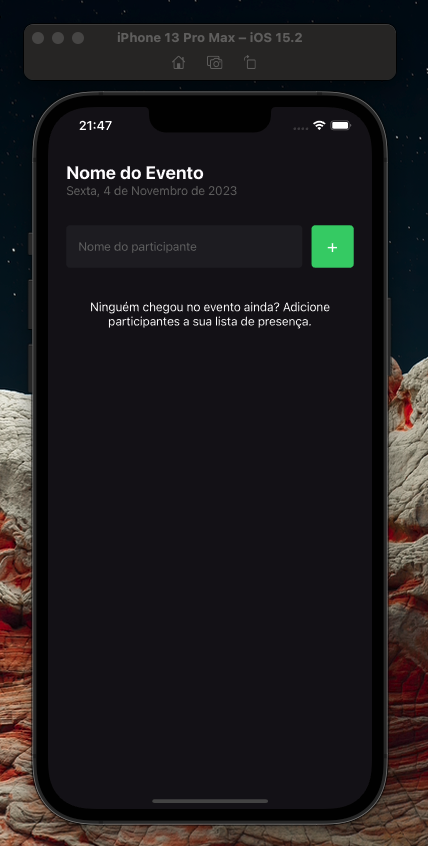
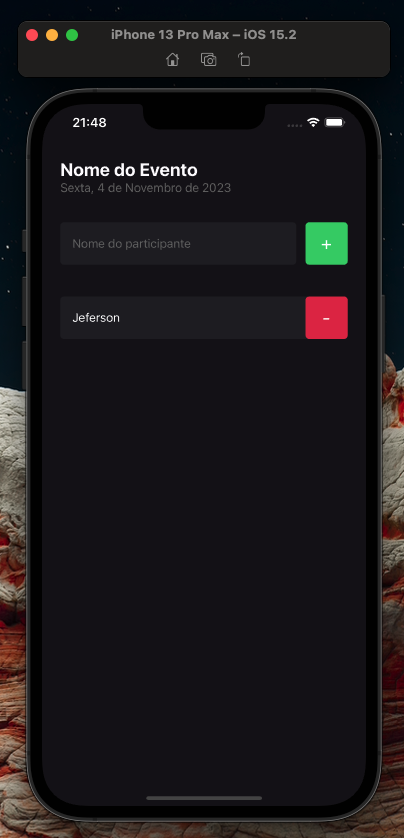
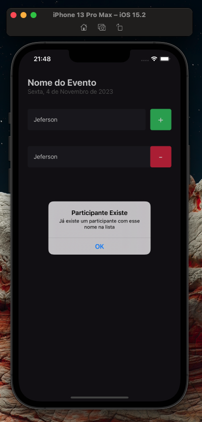
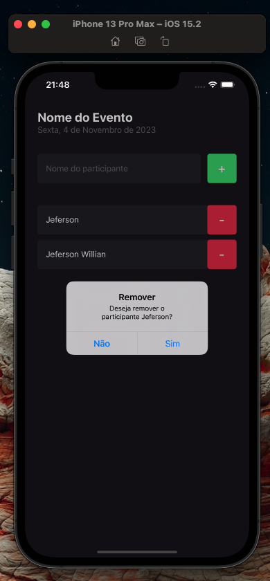
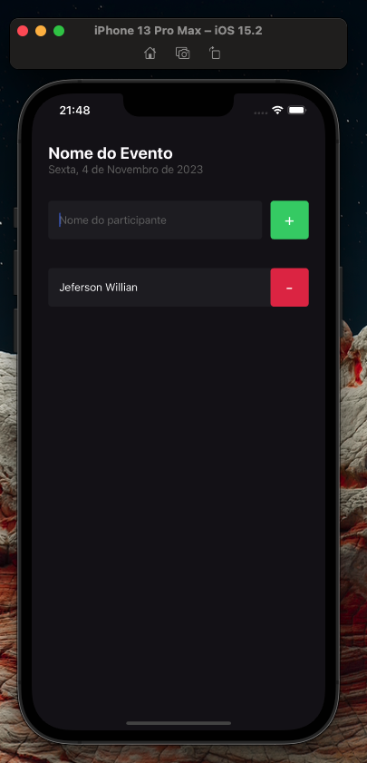

# I Am Here - React Native

<p align="center">
  
</p>

## Description

`I Am Here` is a mobile application powered by React Native, where you can add and manage a list of participants. The user has the option to add new participants, delete them and receive a confirmation alert before completing the action.

## how to run

Before you start, make sure you have the React Native environment set up on your machine.

Clone the repository: git clone https://github.com/your-user/iamhere-reactnative.git

Enter the project folder:

```bash
 cd iamhere-reactnative
```
Install the dependencies:

```bash
npm install
```

Start the development server:

```bash
expo start
```

Run the app on an emulator or physical device using one of the following commands:

```bash
expo android
```

or

```bash
expo ios
```

## Functionalities

- Add new participant: enter the participant's first and last name and click Add".
- Delete participant: slide the list item to the left and click "Delete". The app will display a confirmation alert before completing the action.

## Screens

<p align="center">
    
    
    
</p>
<p align="center">

    
</p>


## Contributing

Feel free to contribute to the project by forking it and submitting a pull request with your changes.

## License

This project is licensed under the MIT license. See the LICENSE file for more details.

## Author

`I Am Here` was developed by Jeferson Carvalho.
